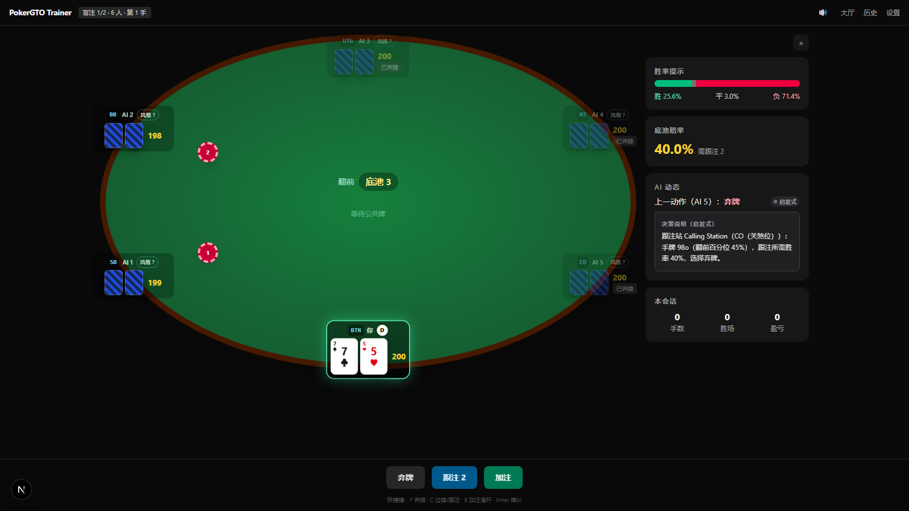
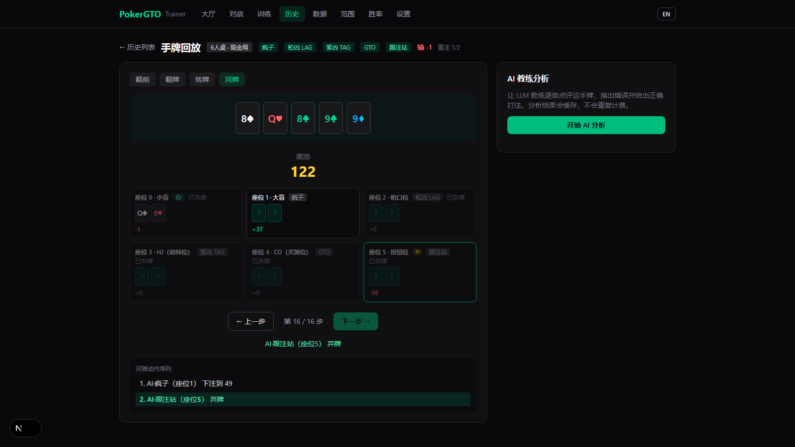
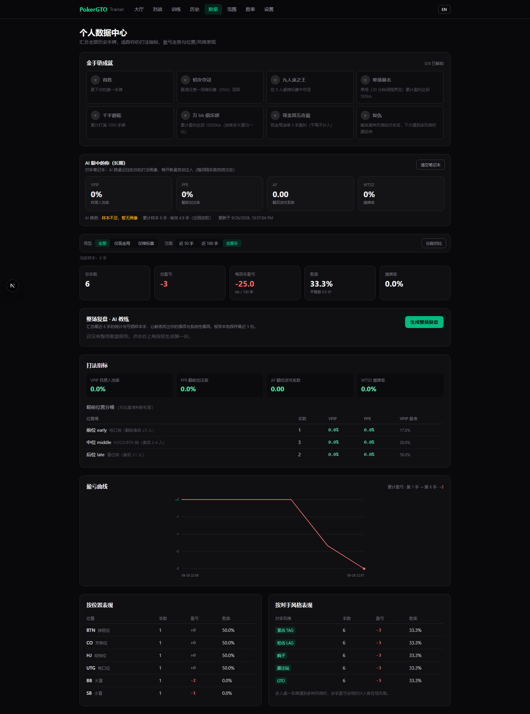

# PokerGTO Trainer

**An open-source, local-first No-Limit Hold'em trainer whose AI opponents are *proven* by large-scale self-play — every shipped mechanic carries a measured bb/100 and a 95% CI, not a hunch.**

[](LICENSE)
[](https://nextjs.org)
[](https://www.typescriptlang.org)
[](#tests)
[](e2e/README.md)
[](#contributing)

**[▶ Play the live demo](https://poker-nu-steel.vercel.app)** · **[GitHub repo](https://github.com/SANTOSRAYYYY/POKER-GTO-TRAINER)** · 中文详细文档见下文

Play 2–9 handed NLHE against style-driven AI opponents — cash games and tournament SNGs — then replay every hand with per-decision reference lines, get an LLM coach review, track your own HUD stats, and drill leaks in quiz trainers. Runs 100% in your browser; plug in any OpenAI-compatible key to unlock LLM opponents and coaching. **Bilingual UI: `EN`/`中文` toggle in the top nav.**

## Why this is different

This is not another poker UI. Three things set it apart:

### 1. Every AI mechanic is validated by seeded self-play

Each shipped mechanism was A/B-tested on 10k–500k hands in a paired-deal simulator (same cards to both arms, seat 0 as the only variable, zero-sum verified per match). The adoption bar is a **fully-positive merged 95% CI** — measured in bb/100:

| Mechanism | Measured net effect (bb/100, paired self-play) | Status |
| --- | --- | --- |
| **Range inference engine** — equity vs the raiser's implied range instead of vs random | **+104.1** (n=96k, 95% CI [+95.6, +112.7]); **+156.8** at 200bb deep | ✅ default ON |
| **Raise-war guardrails** — depth-aware caps that break infinite re-raise chains | fixes chains measured at −598 bb/100/seat; **+19.9** at 200bb, ≈0 at 100bb (value ∝ stack depth) | ✅ default ON |
| **Opponent modeling v2** — positional VPIP/PFR buckets + recency-weighted memory (λ=0.92) | **+21.3** (n=45k, 95% CI [+13.4, +29.2]) | ✅ default ON |
| **Preflop range closure** — real equity vs the raiser's opening range (169×5 offline table) | +5.3 at 100bb → **+29.7** at 200bb (95% CI [+9.7, +49.7]) | ✅ default ON |
| **Slim LLM prompt** — facts only, zero strategy preaching | the only variant profitable in both 240-hand battles; agent-style prompts lost in 5 of 6 matchups | ✅ default |

Just as telling are the mechanisms that **failed validation and stay off by default**: showdown learning (+3.9, CI crosses zero), blocker effects (+0.1, precisely zero), ICM heuristics (rank impact exactly 0.000 across 30 SNGs). The code ships with the knobs — the defaults ship with the evidence. Full write-ups live in [`docs/research/`](docs/research/).

### 2. Two engines, one interface

AI decisions run on a fast, free, fully local **heuristic engine** (Monte Carlo equity, range inference, opponent modeling) — or on **any OpenAI-compatible LLM** you point it at (DeepSeek, Kimi, Moonshot, OpenRouter, …), with per-decision reasoning shown. No key configured or the API fails? It falls back to the heuristic engine silently. **No API key needed to play.**

### 3. A complete training loop, not a single feature

**Play** a hand → **replay** it street by street → compare each decision against the **reference line** (real equity + suggested action, with confidence) → get an **LLM coach review** (per-street ratings + 0–100 score, cached so you never pay twice) → watch your own **HUD** (VPIP/PFR/AF/WTSD, profit curves, per-position splits) → drill the leak in **targeted trainers** (push/fold, postflop equity quizzes). Meanwhile the AI builds a persistent model of *you* across sessions — check "you through the AI's eyes" in the stats page.

## Screenshots

<p align="center">
  
  
  
</p>

## Features

### Training

| Feature | What you get |
| --- | --- |
| Hand replay | Every hand auto-saved to IndexedDB; step through streets, actions and pot changes with position/style/rank annotations |
| GTO reference line | Per-decision badge on every hero decision: Monte Carlo equity + suggested action with confidence (honestly labeled "heuristic reference, not solver-exact") |
| LLM coach review | Per-street ratings + comments + overall 0–100 score, multiway-aware; results cached — never billed twice |
| Personal HUD `/stats` | VPIP/PFR/AF/WTSD with positional buckets, profit curve, per-position and per-style P&L, last-50/100-hand segments, full-session LLM review |
| Quiz trainers `/trainer` | Preflop push/fold (HU SB, random 5–15bb depths) + postflop equity-driven drills, scored separately |
| Range charts | 13×13 matrix: 9-max opening ranges by position + HU button/big-blind attack & defense |
| Equity calculator | Monte Carlo any hole cards vs 1–8 opponents (random or assigned) on any board |

### AI

| Feature | What you get |
| --- | --- |
| Dual decision engine | Local heuristic (instant, free) or LLM with per-decision reasoning; automatic fallback — fully playable with no key |
| 6+ styles | Nit / TAG / LAG / Maniac / Calling station / GTO, plus a "random" mode with hidden per-seat assignments |
| Range inference engine | Equity vs implied ranges instead of vs random — validated at **+104.1 bb/100** |
| Opponent modeling | Positional VPIP/PFR buckets + recency decay; the AI adapts to you across sessions (view/reset in `/stats`) |
| Raise-war guardrails | Depth-aware caps on re-raise chains; deep-stack disasters fixed without hurting 100bb play |
| LLM extras | Self-consistency voting on big pots (≥25bb or river: 3 samples, majority vote, median sizing), slim prompt by default |

### Product

| Feature | What you get |
| --- | --- |
| Cash games, 2–9 handed | Full engine: blinds/antes, betting rounds, all-ins, side pots, showdown; button rotation, chip carryover, auto top-up |
| Tournament SNG | 1500-chip start, 10-level blind structure (table below), 0–3 optional rebuys, spectator mode with fast-forward after you bust |
| Achievements | WSOP bracelet collection (first win, first title, 9-max title, +500bb session, 1000 hands, +10000bb career, 5-table streak, revenge) with toasts & banners |
| Opponent notebook | The AI's persistent profile of *you* across sessions — inspect or wipe it |
| Collapsible info sidebar | Equity/odds/AI panel folds to a floating strip; state persists, drawer on small screens |
| Bilingual & mobile-ready | EN/中文 UI toggle; responsive ring table, touch-friendly action bar |
| Local-first privacy | Hands live in IndexedDB, your API key lives only in your browser's localStorage |

## Quick start

```bash
git clone https://github.com/SANTOSRAYYYY/POKER-GTO-TRAINER.git
cd POKER-GTO-TRAINER
npm install
npm run dev
```

Open http://localhost:3000, pick cash or tournament, table size (2/6/9) and AI styles — play. No API key required.

**Optional LLM unlock** (Settings page): API key + base URL + model. The key stays in your browser's localStorage; requests are proxied server-side via `/api/llm` and never baked into the build.

**Deploy your own**: import the repo into Vercel — zero config. All pages are static/client-rendered; the only backend is the `/api/llm` serverless proxy.

### Recommended LLM setup (DeepSeek)

Validated by 2 × 240-hand LLM variant battles:

| Setting | Recommended | Why |
| --- | --- | --- |
| Base URL | `https://api.deepseek.com` | official root (`/v1` also accepted) |
| Model | `deepseek-flash` | default in Settings |
| Thinking mode | on | DeepSeek V4 `thinking` field |
| Reasoning effort | `high` or `max` | `reasoning_effort`; `max` is V4-only |
| Max tokens | `8192` | thinking spends the same budget — prevents truncated coach reviews |
| Force JSON output | on | `response_format`; sharply cuts parse failures |
| Prompt style | slim (default) | strategy preaching induces mechanical threshold play ("win small, lose big"); slim was the only variant profitable in both battles |

## Tournament structure (SNG)

1500 starting chips, blinds up every 8 hands, 10 levels (top level repeats):

| Level | SB/BB | Ante |
| --- | --- | --- |
| 1 | 10/20 | – |
| 2 | 15/30 | – |
| 3 | 25/50 | – |
| 4 | 50/100 | 12 |
| 5 | 75/150 | 18 |
| 6 | 100/200 | 25 |
| 7 | 150/300 | 37 |
| 8 | 200/400 | 50 |
| 9 | 300/600 | 75 |
| 10 | 400/800 | 100 |

Optional 0–3 rebuys per player during the first 4 levels. Finishing positions by bust order (same-hand busts ranked by starting chips); last stack standing wins.

## Architecture

Next.js 16 (App Router + Turbopack) · React 19 · TypeScript 7 · Tailwind v4 · zustand · idb (IndexedDB) · Vitest · Playwright

```
src/
├── app/               # lobby / · table /play · /history (+/history/[id] replay) · /stats ·
│                      # /trainer · /ranges · /equity · /settings · /api/llm proxy
├── lib/
│   ├── poker/         # pure engine: N-handed state machine · SNG blind scheduler ·
│                      # 7-card evaluator · Monte Carlo equity
│   ├── ai/            # opponent.ts (LLM first, heuristic fallback) · brain.ts / heuristic.ts ·
│                      # range.ts · adapt.ts (opponent modeling) · prompt.ts · profiles.ts · hudStats.ts
│   ├── gto/           # push/fold tables · postflop quiz · per-decision reference line
│   ├── llm/           # browser-side LLM client (via /api/llm)
│   └── store/         # zustand: game flow · history persistence · achievements · notebook · session save
└── components/        # table / history / stats UI
scripts/selfplay/      # seeded paired self-play bench → bb/100 + 95% CI
docs/research/         # 22 curated experiment reports
e2e/                   # 7 Playwright real-browser smoke tests
```

## Tests

```bash
npm test          # 625 unit/integration tests: engine / AI / stores / components / routes
npx tsc --noEmit  # type check (TypeScript 7)
npm run build     # production build (Turbopack)

npx playwright install chromium   # first time only
npm run test:e2e  # 7 real-browser smoke cases, dev server auto-starts on port 3105
```

## Self-play research bench

`scripts/selfplay/` is a headless simulator that drives the **same** engine (`src/lib/poker/game.ts`) and decision brain (`src/lib/ai/brain.ts`) as production — no React, fully synchronous. Experiments are paired: one master seed deals identical cards to both arms, seat 0 is the only variable, and its profit difference is the mechanic's isolated net effect, reported as bb/100 with a 95% CI and per-match zero-sum verification. Adoption rule: merged CI fully positive. Every default-on mechanic passed it; the rejected ones remain in the codebase, off by default, knobs intact for future A/B. Run your own with `scripts/selfplay/README.md`.

Start with these reports:

- [phase4-range-6max-report.md](docs/research/phase4-range-6max-report.md) — range inference engine, **+104.1 bb/100** over 96k paired hands
- [phase6-adapt-report.md](docs/research/phase6-adapt-report.md) — opponent modeling v2, **+21.3 bb/100**
- [phase9-deep-retest-report.md](docs/research/phase9-deep-retest-report.md) — 200bb retests: preflop closure **+29.7**, three mechanisms honestly rejected
- [llm-battle-report.md](docs/research/llm-battle-report.md) — 4 models × {agent, raw} battle royale; agent prompt layer hurt 5 of 6 matchups
- [prompt-diagnosis.md](docs/research/prompt-diagnosis.md) — qualitative autopsy: *why* a preachy prompt makes an LLM play "win small, lose big"
- [coachlab-report.md](docs/research/coachlab-report.md) — coach-prompt variants blind-judged by an LLM jury

## Roadmap

- [x] 2–9 handed engine with side pots & showdown
- [x] Tournament SNG + rebuys + spectator fast-forward
- [x] Range inference engine (+104.1 bb/100, validated)
- [x] Opponent modeling v2 (+21.3 bb/100, validated)
- [x] Preflop range closure (+29.7 bb/100 at 200bb, validated)
- [x] LLM opponents & LLM coach (any OpenAI-compatible provider)
- [x] Personal HUD, quiz trainers, range charts, equity calculator
- [x] Bilingual UI + mobile adaptation + E2E smoke suite
- [ ] Real solver integration — replace heuristic reference lines with solver-exact solutions
- [ ] Online multiplayer
- [ ] More training scenarios (3-bet pots, blind-vs-blind, ICM/bubble drills)

## Contributing

PRs, issues and experiment ideas are welcome.

- Keep it green: `npm test` (625 tests) and `npx tsc --noEmit` must pass; run `npm run test:e2e` for UI changes.
- Changing an AI mechanic? Ship paired self-play evidence (bb/100 + 95% CI) in the PR — that is how every default in this repo earned its place. `scripts/selfplay/` has the bench.
- UI strings live in `src/lib/i18n/` — add both English and Chinese entries.
- E2E selectors use roles/text/placeholders only; please don't add `data-testid` to `src`.

## License

[MIT](LICENSE)

---

# PokerGTO Trainer — 德州扑克 AI 训练器（中文详细文档）

> 在线 demo：https://poker-nu-steel.vercel.app ｜ GitHub：https://github.com/SANTOSRAYYYY/POKER-GTO-TRAINER
>
> 这不是又一个扑克 UI：每一个默认开启的 AI 机制都在种子配对自对战台架上跑过 1万-50万 手验收（bb/100 + 95% CI 全正才采纳）——范围引擎 +104.1、对手建模 +21.3、翻前闭环 +29.7（200bb），未过线的机制（摊牌学习、blocker、ICM）一律默认关闭。22 份实验报告见 `docs/research/`。

一个本地运行的无限注德州扑克（No-Limit Hold'em）训练器：支持 2-9 人桌，你坐在牌桌一端，其余座位是不同风格的 AI 对手。打完的每一手牌都可以回放、交给 LLM 教练逐街复盘点评。**界面支持中英文切换（导航栏右侧 `EN`/`中文` 开关）。**

## 功能清单

- **2-9 人桌对战**：完整引擎（盲注/ante/下注轮/全下/边池/摊牌比大小），按钮逐手轮转、筹码逐手结转；现金局 AI 筹码不足大盲自动补码，hero 可重置买入或短码继续
- **锦标赛 SNG**：起始筹码 1500，按固定结构升盲（见下表）；筹码清零即淘汰并记录最终名次，hero 出局后进入观战模式，可快进 AI 自打直到冠军产生
- **锦标赛重购（rebuy）**：大厅可选每人 0-3 次重购。重购期内（前 4 个盲注级别，按出局手所在级别判定）筹码归零可买回起始筹码：AI 自动重购，hero 弹出「重购继续 / 认输离场」选择；次数用完或重购期外归零即正常淘汰
- **6+ 种 AI 风格**：紧弱 Nit / 紧凶 TAG / 松凶 LAG / 疯子 Maniac / 跟注站 / GTO 均衡，以及「随机」模式（每座独立抽取一种，对你保密）
- **双引擎决策**：设置页可切换「启发式」（本地规则引擎，快、免费）或「LLM」（每个 AI 决策都调大模型并给出思考说明）；LLM 未配置或调用失败时自动降级启发式，**不填 API Key 也能完整游玩**
- **可折叠信息侧栏**：对战页右侧的胜率/底池赔率/AI 动态面板可一键收起为悬浮窄条（保留胜率与赔率迷你数字），折叠状态跨刷新记住（localStorage）；小屏默认折叠，展开时以抽屉形式悬浮
- **位置系统**：2-9 人桌标准位置命名（BTN/SB/BB/UTG/UTG+1/UTG+2/LJ/HJ/CO），AI prompt、回放座位栏与复盘文本共用同一套映射
- **历史回放**：每手牌自动保存到浏览器 IndexedDB，回放器逐街、逐步进查看动作与底池变化，座位栏标注位置/风格/名次
- **AI 复盘**：LLM 教练按「每街评级 + 逐条点评 + 总评 + 0-100 评分」输出中文复盘（含多人底池动态点评），结果缓存不重复计费
- **范围表**：13×13 起手牌矩阵，9 人桌各位置开局范围 + 单挑按钮位/大盲攻防
- **胜率计算器**：蒙特卡洛模拟任意底牌 vs 1-8 名对手（随机或指定手牌）在不同公共牌面下的胜率
- **数据中心 `/stats`**：核心指标（总手数/总盈亏/bb 每百手/胜率/摊牌率）、打法四指标 VPIP/PFR/AF/WTSD（含翻前位置分桶）、盈亏曲线、按位置与按 AI 风格的盈亏拆分、近 50/100 手分段对比，以及整段会话的 LLM 复盘报告
- **成就系统**：WSOP 金手链成就（首胜/首个冠军/九人桌冠军/单场盈利 500bb/累计 1000 手/累计盈利 10000bb/现金局五连胜/复仇），新解锁弹出 Toast 与升级横幅，纯本地持久化
- **训练器 `/trainer`**：翻前 Push/Fold（单挑 SB 位 5-15bb 随机深度）与翻后特训（实算胜率驱动决策）两种刷题模式，分开计分统计
- **GTO 参考线**：回放时 hero 的每个决策点旁显示参考徽章——实算胜率（蒙特卡洛）+ 建议动作倾向（加注/跟注/过牌/弃牌，含置信度）；统一标注「启发式参考线，非 solver 精确解」
- **对手笔记本**：AI 对 hero 的长期画像跨 session 持久化（近因衰减记忆），AI 越打越懂你；数据中心可查看「AI 眼中的你」并重置
- **移动端适配**：小屏下信息侧栏默认折叠为悬浮窄条/抽屉，牌桌环形座位与动画按视口宽度自适应，行动栏适配触屏（隐藏键盘快捷键提示）
- **E2E 冒烟**：7 条 Playwright 真实浏览器用例（大厅开局/弃牌自动下一手/历史回放/数据中心/训练器答题/设置持久化），见 `e2e/README.md`

## 锦标赛结构（SNG）

起始筹码 1500，每 8 手升一级，共 10 级（到顶后按顶级继续）：

| 级别 | 小盲/大盲 | ante |
| --- | --- | --- |
| 1 | 10/20 | – |
| 2 | 15/30 | – |
| 3 | 25/50 | – |
| 4 | 50/100 | 12 |
| 5 | 75/150 | 18 |
| 6 | 100/200 | 25 |
| 7 | 150/300 | 37 |
| 8 | 200/400 | 50 |
| 9 | 300/600 | 75 |
| 10 | 400/800 | 100 |

淘汰名次按出局顺序排定（同手多人出局按开手筹码排序，筹码少者名次靠后）；最后幸存者为冠军。

### 重购规则

- 大厅可为锦标赛选择每人 0-3 次重购（默认 0 = 不可重购，URL 参数 `rebuys=0-3`）。
- **重购期 = 前 4 个盲注级别**；判定按「出局手所在级别」（一手结束先判定重购再升盲，故恰好触发升盲的那手仍按升盲前的级别算）。
- 重购期内筹码归零：AI 自动买回起始筹码继续（无淘汰播报）；hero 弹出选择——「重购继续」消耗一次次数并买回 1500，或「认输离场」按当前名次淘汰。
- 次数用完、或第 5 级起归零，即正常淘汰。重购注入的筹码计入筹码守恒基准，但不影响出局手本身的盈亏记录（每手盈亏恒按该手开手筹码计算）。

## `/api/llm` 错误码

LLM 代理路由（POST，body `{ config, messages }`）的错误约定——所有错误均为 JSON `{ error: string }`：

| 状态码 | 含义 | 典型原因 |
| --- | --- | --- |
| 400 | 请求本身非法，未发往上游 | body 非 JSON；缺 `config.apiKey` / `config.model` / `messages`；`baseUrl` 无 `http(s)://` 前缀、含空格或不是合法 URL |
| 502 | 上游服务异常 | 上游返回非 2xx（透传状态码与上游消息节选，如 401 Key 无效）；上游 200 但 body 非 JSON（如 HTML 错误页）；响应缺少 `choices[0].message.content`；网络/ DNS 等 fetch 失败 |
| 504 | 上游超时 | 55 秒内未拿到上游响应（路由 `maxDuration=60`，留出返回可读错误的余量） |
| 500 | 代理自身意外异常 | 顶层兜底（正常不会触发；此前版本的空 500 已修复为可读 JSON） |

`baseUrl` 留空时默认 `https://api.openai.com/v1`。

## 快速开始

```bash
npm install
npm run dev
```

打开 http://localhost:3000 ，在大厅选择模式（现金局/锦标赛）、人数（2/6/9）与 AI 风格，点击开始即可。

## 配置 API Key（可选）

进入「设置」页，填写三项并保存：

- **API Key**：你的密钥（只保存在浏览器 localStorage，请求经本站 `/api/llm` 服务端代理转发，不进构建产物）
- **Base URL**：任何 OpenAI 兼容服务的地址，例如
  - DeepSeek：`https://api.deepseek.com`（官方根地址；`/v1` 也兼容）
  - Kimi 订阅：`https://api.kimi.com/coding/v1`（走会员订阅额度，与 Moonshot 开放平台按量 Key 不通用）
  - Moonshot：`https://api.moonshot.cn/v1`
  - OpenRouter：`https://openrouter.ai/api/v1`
- **模型**：如 `deepseek-flash`、`kimi-k2`、`gpt-4o-mini` 等（设置页默认 `deepseek-flash`）

设置页提供「测试连接」与「测试复盘格式」按钮可直接验证配置与 JSON 遵循度；「AI 决策引擎」开关决定 AI 用本地启发式还是 LLM 出牌。不填 Key 时 AI 自动使用内置启发式策略，所有功能（除 LLM 复盘）照常可用。

### 推荐 LLM 配置（DeepSeek V4）

经 240 手 × 2 场 LLM 变体大战验证的推荐组合：

| 项 | 推荐值 | 说明 |
| --- | --- | --- |
| Base URL | `https://api.deepseek.com` | 官方根地址 |
| 模型 | `deepseek-flash` | 设置页默认 |
| 思考模式 | 开启（thinking，默认即为开） | DeepSeek V4 的 `thinking` 字段 |
| 思考程度 | `high` 或 `max` | `reasoning_effort`；`max` 仅 DeepSeek V4 支持 |
| 输出上限 | `8192` | 思考内容也占 max_tokens 额度，复盘长输出防截断 |
| 强制 JSON 输出 | 开 | `response_format`，显著降低解析失败率 |
| prompt 风格 | 精简（默认） | 注入胜率/策略说教会诱导机械阈值决策（赢小输大），「精简」是唯一两场皆盈利的版本 |

## 部署（Vercel）

直接把仓库导入 Vercel 即可：自动识别 Next.js，无需改任何配置（无自定义构建命令/输出目录）。所有页面为静态/客户端渲染，唯一的后端是 `/api/llm`——它会部署为 Vercel serverless function，负责把浏览器里的 LLM 请求转发到你配置的 OpenAI 兼容服务（Key 仍只存在访客浏览器中）。

## 技术架构

Next.js 16（App Router + Turbopack）+ React 19 + TypeScript 7 + Tailwind CSS v4，前端状态用 zustand，历史记录持久化到 IndexedDB（idb）。

- `src/lib/types.ts` — 全局唯一类型契约（牌、动作、GameState、HandRecord、锦标赛配置、LLM 配置等）
- `src/lib/poker/` — 纯函数扑克引擎：`game.ts` N 人状态机（createGame / legalActions / applyAction）、`tournament.ts` SNG 升盲调度、`evaluator.ts` 七张牌比大小、`equity.ts` 蒙特卡洛胜率
- `src/lib/ai/` — AI 对手：`opponent.ts` 决策入口（LLM 优先、启发式兜底）、`heuristic.ts` 本地策略、`profiles.ts` 风格档案与风格分配、`positions.ts` 位置命名、`prompt.ts` 提示词构造与输出解析、`adapt.ts` 对手建模（近因衰减）、`hudStats.ts` 数据中心统计聚合
- `src/lib/gto/` — 训练与参考：`pushfold.ts` 翻前全下/弃牌表、`postflopQuiz.ts` 翻后特训题、`reference.ts` 决策点级 GTO 参考线
- `src/lib/llm/` — `client.ts` 浏览器侧 LLM 调用封装（走 `/api/llm` 代理）
- `src/lib/store/` — zustand stores：`gameStore.ts` 牌局流程编排（座位压缩映射、升盲/淘汰/名次、观战快进、HandRecord 生成）、`historyStore.ts` 历史持久化与 LLM 复盘、`achievements.ts` 成就、`notebook.ts` 对手笔记本、`sessionPersistence.ts` 整局存档恢复
- `src/app/` — 页面：大厅 `/`、牌桌 `/play`、历史 `/history` 与回放 `/history/[id]`、数据中心 `/stats`、训练器 `/trainer`、范围表 `/ranges`、胜率计算器 `/equity`、设置 `/settings`、LLM 代理 `/api/llm`

## 测试

```bash
npm test          # vitest run：引擎 / AI / store / 组件 / 路由共 625 个测试
npx tsc --noEmit  # 类型检查（TypeScript 7）
npm run build     # 生产构建（Turbopack）

# E2E（首次先装浏览器）
npx playwright install chromium
npm run test:e2e  # 7 条真实浏览器冒烟，自动起 dev server（端口 3105）
```
